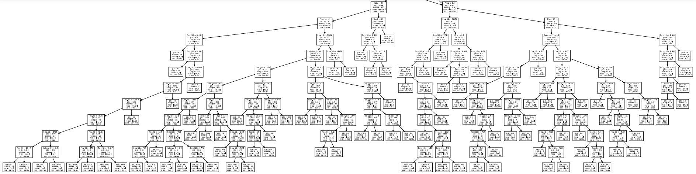

# Titanic : Machine Learning From Disaster

## Predict survival on the Titanic

  <small>
    [See <a href="https://www.kaggle.com/c/titanic/overview">Titanic - Machine Learning from Disaster (Kaggle URL)</a>]
  </small>

## Introduction

 

### Object

 

This competition can make you dive into ML competitions and familiarize your self with how to solve Kaggle problem.

 

This competition's object is so simple : Create Machine Learning algorithm that predicts which passenegers survived in the ship.

On April 15, 1912, Titanic sank after colliding with an iceberg. Unfortunately, there weren't enough lifeboats for everyone onboard, resulting in the death of 1,502 out of 2,224 passengers and crew. (The lifeboat has s capacity of only 1,178 people only. So, only 706 people were rescued.)

 

### Data Fields from Titanic)

 

- Survived : 0 = died, 1 = survived

 

- Pclass : Ticket class for passengers
  - 1st = Upper
  - 2nd = Middle
  - 3rd = Lower

 

- Sex : gender of passengers (composed of male and female)

 

- Age : Passenger's age (if age less than 1, it's fractional)

 

- Sibsp : The sibsp defines family relations in this way.
  - Sibling = brother, sister, stepbrother, stepsister
  - Spouse = husband, wife

 

- Parch : The parch defines family relations
  - Parent = mother, father
  - Child = daughter, son, stepdaughter, stepson

 

- Ticket : Number of ticket

  
 
 * Fare : Fare fee of Titanic
 
  
 
 * cabin : Cabin number
 
  
 
 * embarked : Port of Embarkation 
   - C = Cherbourg
   - Q = Queenstown
   - S = Southampton
   
    
   
### Evaluation

 

Our goal is to predict whether the passengers in test.csv have died or not individually. (Use Classifier)

  

Your score is the percentage of passengers you correctly predict. This is known as accuracy.

  

$$ Accuracy = \frac{TP + TN}{TP + TN + FP + FN} $$

  

TP = True positive; FP = False positive; TN = True negative; FN = False negative

### Precedure [[See link]](https://github.com/ChaHoHyun/Bike-Sharing-Demand_score_0.3794/blob/main/Bike%20Sharing%20Demand_registered_Score_.ipynb)

There will be follow steps for how to solve this problem. [[See link]](https://github.com/ChaHoHyun/Titanic_score_0.811/blob/main/Titanic_0.811.ipynb)

1. Import CSV file by using Pandas (Collecting Data)
2. Exploratory Data Analysis (EDA)
3. Explore (Preprocessing)

4. Training (For Machine Learing - **Decision Tree**)

5. Visualization

6. Submit

   Through the fit and predict of the decision tree, we predicted whether or not the passenger in the test data was survived. Now all we have left to do is to organize them according to the submission format recommended by Kaggle ([kaggle](http://kaggle.com/)) and save them as a file.

   Kaggle's Titanic Competition ([Titanic: Machine Learning from Disaster] (https://www.kaggle.com/c/titanic)) offers a submission format called **gender_submission.csv**. ([Download Link](https://www.kaggle.com/c/titanic/data)) We will insert and store our predicted values in this submission format.
